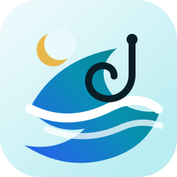
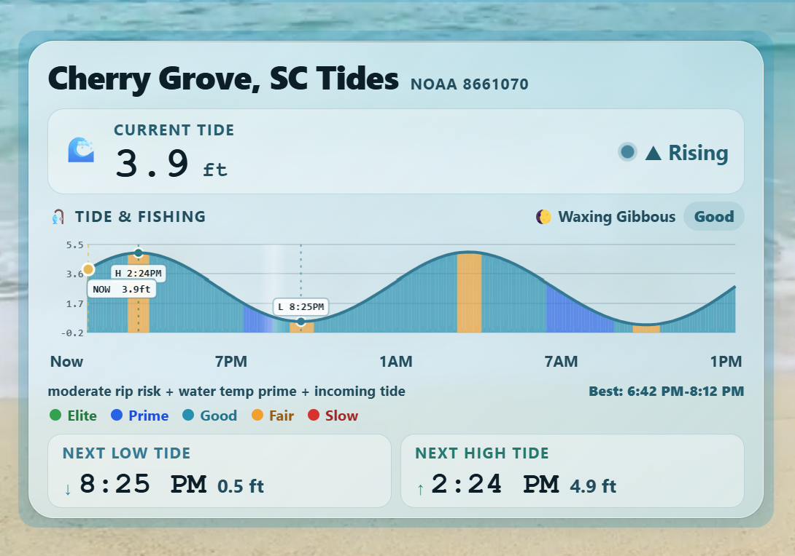
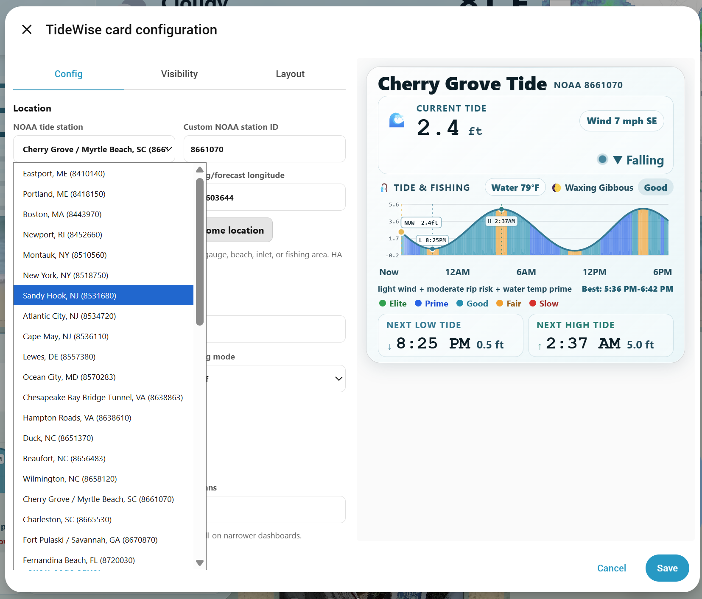

# TideWise

<p align="center">
  
</p>

[](https://github.com/TheWillMiller/tide-wise/releases)
[](https://github.com/TheWillMiller/tide-wise/actions/workflows/validate.yml)
[](https://github.com/TheWillMiller/tide-wise/stargazers)

**Current release candidate:** `v0.4.5`

TideWise is a Home Assistant dashboard (Lovelace) custom card for NOAA tide predictions, current tide height, next high/low tides, and optional fishing bite-window scoring.

## Screenshots

### Main TideWise Card



### NOAA Station Picker



### Visual Editor


It combines NOAA tide data with local Home Assistant entities such as weather, wind, water temperature, surf height, pressure, rain, and rip current risk. Missing optional entities are allowed; TideWise falls back to neutral scoring where possible.

> **Beta notice:** TideWise is still early beta software. Please expect occasional layout issues, missing-data fallbacks, and station-specific quirks while testing.

## Beta Feedback

TideWise is in beta. If it works for your setup, please consider starring the repo so I can gauge interest and so you can follow development:

[Star TideWise on GitHub](https://github.com/TheWillMiller/tide-wise)

If you run into issues or want to confirm your station works, please open one of these quick reports:

- [Beta Install Report](https://github.com/TheWillMiller/tide-wise/issues/new?template=beta-install-report.yml)
- [Works For Me / Confirmed Station](https://github.com/TheWillMiller/tide-wise/issues/new?template=works-for-me-confirmed-station.yml)

Helpful details include Home Assistant version, HACS version, TideWise version, browser/device, NOAA station ID, and a screenshot or console error if something broke.

## Features

- NOAA tide predictions using a configurable station ID
- Current interpolated tide height
- Next high and low tide
- 24-hour tide chart
- High/low fallback for NOAA stations without full interval predictions
- Visual editor support
- 50-station preset picker plus custom NOAA station ID
- Optional fishing bite-window score
- Fishing modes for general, surf, inlet, flounder, trout/redfish, and sheepshead use
- Optional NOAA/NWS public data fetching
- Optional Home Assistant entity overrides for weather, wind, water temperature, surf height, pressure, rain, and rip current risk
- Legacy support for `custom:cherry-grove-tides-card`

## Installation

### Recommended: HACS Custom Repository

TideWise is not yet listed in the default/searchable HACS store. Until it is accepted into the default HACS list, install it as a custom HACS repository.

1. Open **HACS** in Home Assistant.
2. Open the three-dot menu in the top right.
3. Choose **Custom repositories**.
4. Add this repository URL:

```text
https://github.com/TheWillMiller/tide-wise
```

5. For category, choose **Dashboard**.

   If your HACS version uses older wording, choose the dashboard/card/frontend/plugin-style option.

6. Install **TideWise**.
7. Refresh Home Assistant.

A hard browser refresh is recommended after installing or updating:

- Windows/Linux: `Ctrl + F5`
- Mac: `Cmd + Shift + R`

Then add the card from your dashboard editor:

1. Edit your dashboard.
2. Add a new card.
3. Search for **TideWise**.
4. Open the visual editor.
5. Select a NOAA station or enter a custom station ID.
6. Save.

### Manual Install

1. Download or copy `tidewise-card.js`.
2. Place it in your Home Assistant `www` directory.
3. Add it as a dashboard resource:

```yaml
url: /local/tidewise-card.js
type: module
```

4. Refresh Home Assistant and hard-refresh your browser.
5. Add the card to a dashboard.

### Test From GitHub CDN

For quick testing before installing locally, you can add this dashboard resource:

```yaml
url: https://cdn.jsdelivr.net/gh/TheWillMiller/tide-wise@v0.4.5/tidewise-card.js
type: module
```

After changing resources, refresh Home Assistant and hard-refresh the browser tab.

> CDN testing is not the preferred long-term install method. HACS is recommended for normal use.

## Quick Start

```yaml
type: custom:tidewise-card
title: Local Tides
station: "8661070"
units: english
mode: general
auto_sources: true
auto_surf_forecast: true
grid_options:
  rows: full
  columns: 18
```

## Minimal Config

```yaml
type: custom:tidewise-card
title: Local Tides
station: "8661070"
units: english
mode: general
```

## Cherry Grove Example

```yaml
type: custom:tidewise-card
title: Cherry Grove Tides
station: "8661070"
units: english
mode: inlet
auto_sources: true
auto_surf_forecast: true
weather_entity: weather.nws_33_8552645_78_6761264_kmyr
water_temp_entity: sensor.noaa_surf_water_temperature
wave_height_entity: sensor.noaa_surf_surf_height
rip_current_risk_entity: sensor.noaa_surf_rip_current_risk
wind_speed_entity: sensor.noaa_weather_wind_speed
wind_direction_entity: sensor.noaa_weather_wind_direction
pressure_entity: sensor.noaa_weather_barometric_pressure
rain_today_entity: sensor.rain_sensor_rain_last_24h
grid_options:
  rows: full
  columns: 18
```

## Tide-Only Config

```yaml
type: custom:tidewise-card
title: Local Tides
station: "8661070"
units: english
show_fishing_score: false
grid_options:
  rows: full
  columns: 18
```

## Dashboard Size

TideWise is a dense chart card. In Home Assistant section/grid dashboards, give it enough horizontal space:

```yaml
grid_options:
  rows: full
  columns: 18
```

On narrower dashboards, use:

```yaml
grid_options:
  rows: full
  columns: full
```

## Visual Editor

TideWise includes a Home Assistant visual editor. When adding the card from the dashboard editor, you can:

- Choose 50 common NOAA tide stations from a dropdown
- Enter a custom NOAA station ID
- Set latitude and longitude
- Use your Home Assistant home latitude/longitude
- Select English or metric units
- Select fishing mode
- Enable or disable fishing score
- Enable or disable public NOAA/NWS auto sources
- Enable or disable NWS surf/rip forecast parsing
- Set the recommended dashboard size

The station dropdown is a 50-station starter list, not a complete NOAA station database. If your station is not listed, choose **Custom station ID** and paste the NOAA CO-OPS station ID.

## Auto Sources

TideWise can fetch extra public NOAA/NWS data directly from the browser when `auto_sources` is enabled:

- NOAA CO-OPS water temperature, wind, and air pressure where the selected station supports those products
- NWS hourly forecast weather and wind from latitude/longitude
- NWS Surf Zone Forecast text for surf height, rip current risk, and water temperature where the local forecast office issues an SRF product

Manual Home Assistant entities take priority. If a manual entity is configured, TideWise uses it instead of the auto-fetched value.

Surf Zone Forecasts are text products and vary by NWS office. TideWise parses common formats such as:

- `high rip current risk`
- `surf height 2 to 4 feet`
- `water temperature in the mid 80s`

Some locations may still show unknown surf or rip data. Manual entities or dedicated integrations remain the most reliable override.

Recent rainfall totals are not yet reliably auto-filled. They work best through a local rain sensor or Home Assistant weather integration.

## Fishing Score

The fishing score is advisory only. It is intended to give a quick glance at likely better and worse bite windows.

Depending on available data, TideWise may consider:

- Tide movement
- Tide direction
- Time to next high/low tide
- Current tide height
- Moon/solunar timing
- Time of day
- Weather condition
- Wind speed
- Wind direction
- Water temperature
- Surf/wave height
- Rip current risk
- Pressure
- Pressure trend
- Rainfall/runoff

When optional data is missing, TideWise falls back to the data it has available.

## Configuration

| Option | Required | Default | Description |
| --- | --- | --- | --- |
| `type` | Yes |  | Use `custom:tidewise-card`. The legacy `custom:cherry-grove-tides-card` alias also works. |
| `title` | No | `TideWise` | Card title. |
| `station` | Yes |  | NOAA tides and currents station ID. |
| `units` | No | `english` | NOAA units. Usually `english` or `metric`. |
| `mode` | No | `general` | Fishing score mode: `general`, `surf`, `inlet`, `flounder`, `trout_redfish`, or `sheepshead`. |
| `show_fishing_score` | No | `true` | Set to `false` for a tide-only card. |
| `auto_sources` | No | `true` | Fetch public NOAA/NWS weather and marine observations directly where available. |
| `auto_surf_forecast` | No | `true` | Try to parse NWS Surf Zone Forecast text for surf height, rip current risk, and water temperature. |
| `nws_office` | No | Auto from NWS point metadata | Optional NWS office code such as `ILM`, `CHS`, or `SGX` for Surf Zone Forecast products. |
| `latitude` | No | Home Assistant home latitude, then Cherry Grove fallback | Latitude for moon/solunar scoring. |
| `longitude` | No | Home Assistant home longitude, then Cherry Grove fallback | Longitude for moon/solunar scoring. |
| `weather_entity` | No | First available weather entity | Weather condition source. |
| `water_temp_entity` | No |  | Water temperature sensor. Fahrenheit and Celsius are supported. |
| `wave_height_entity` | No |  | Wave/surf height sensor. Feet and meters are supported. |
| `rip_current_risk_entity` | No |  | Rip current risk sensor. |
| `unsafe_to_swim_entity` | No |  | Boolean or text entity for unsafe surf/swim conditions. |
| `wind_speed_entity` | No | Weather attribute fallback | Wind speed sensor. mph, km/h, m/s, and knots are supported. |
| `wind_direction_entity` | No | Weather attribute fallback | Wind bearing in degrees. |
| `pressure_entity` | No | Weather attribute fallback | Barometric pressure. hPa and inHg are supported. |
| `pressure_trend_entity` | No |  | Pressure trend entity. |
| `rain_today_entity` | No |  | Rainfall in the last 24 hours. Inches and mm are supported. |

## Finding a NOAA Station

Use a NOAA tides and currents station ID near your location. TideWise uses the NOAA CO-OPS data API, so station IDs must support tide predictions.

If your station does not work, try a nearby NOAA station that supports tide predictions.

## Troubleshooting

If TideWise works for you after troubleshooting, please consider starring the repo or opening a Works For Me / Confirmed Station report. If it breaks, a Beta Install Report with your versions and station ID helps a lot.

### TideWise does not show in the card picker

1. Confirm TideWise is installed in HACS.
2. Hard-refresh the browser.
3. Restart Home Assistant if needed.
4. Check that the card resource exists.
5. Open the browser console and look for TideWise errors.

### HACS shows an old README or old version

HACS may cache repository metadata.

Try:

1. Open HACS.
2. Open TideWise.
3. Open the three-dot menu.
4. Select **Redownload**.
5. Choose the latest version.
6. Hard-refresh your browser.

If HACS still shows an old README, the installed card file may still be current while the HACS display cache is stale.

If HACS shows a short value like `214b6c2` instead of `v0.4.5`, that is a GitHub commit hash. HACS shows commit hashes when a repository has tags but no full GitHub Release yet. Publishing a full GitHub Release makes HACS show the release version instead.

### Card does not show up

1. Confirm TideWise is installed.
2. Confirm the dashboard resource exists.
3. Hard-refresh the browser.
4. Redownload the latest release in HACS.
5. Restart Home Assistant if needed.
6. Check the browser console for `tidewise-card.js` loading errors.

### Visual editor does not show

1. Confirm the latest TideWise JS is loaded.
2. Hard-refresh the browser.
3. Redownload the latest HACS release.
4. Check the browser console for custom element errors.

### Tide data unavailable

1. Verify the NOAA station ID.
2. Try a known preset station.
3. Confirm your browser/Home Assistant can reach NOAA.
4. Open the browser console and check for network or station errors.

### Fishing score looks limited

This usually means optional weather, wind, water temperature, surf, pressure, rain, or rip current data is unavailable.

The card should still work, but the score may be based on fewer inputs.

## Privacy

TideWise does not include telemetry, tracking pixels, external analytics, or phone-home behavior.

When `auto_sources` or `auto_surf_forecast` are enabled, the card fetches the public NOAA/NWS data needed to render the configured dashboard card. Adoption tracking is based only on GitHub-native signals such as stars, issues, release activity, and tester reports.

Maintainer notes for GitHub-native adoption signals are in [PROJECT_INSIGHTS.md](PROJECT_INSIGHTS.md).

## Beta Tester Checklist

The full checklist is also available in [BETA_TESTER_CHECKLIST.md](BETA_TESTER_CHECKLIST.md).

If you are testing TideWise, please report:

- Home Assistant version
- HACS version
- TideWise version
- Browser/device
- NOAA station ID used
- Whether you installed from HACS custom repository, manual resource, or CDN
- Screenshot of any layout issue
- Browser console errors, if any
- Whether the issue happens after a hard refresh

Basic test steps:

1. Install TideWise from HACS custom repository.
2. Add the card from the dashboard card picker.
3. Open the visual editor.
4. Select a preset station.
5. Save.
6. Refresh the dashboard.
7. Confirm the card still loads.
8. Change fishing mode.
9. Save and refresh again.
10. Test on desktop and phone.
11. Test with missing optional entities.
12. Screenshot or copy any errors.

## Safety

TideWise is informational. It is not a marine safety, navigation, emergency, or surf safety tool.

Always check official local forecasts, marine advisories, beach warnings, and on-site conditions before entering the water or boating.

Do not use TideWise for navigation, hazardous surf decisions, boating safety, swimming safety, or life-safety decisions.

## License

Free for personal and non-commercial use under PolyForm Noncommercial License 1.0.0.

Commercial use requires separate written permission.

## Development

The distributable card is:

```text
tidewise-card.js
```

For HACS default repository submission, TideWise is a dashboard/custom card. HACS validation/submission uses the `plugin` category internally for dashboard plugins.
